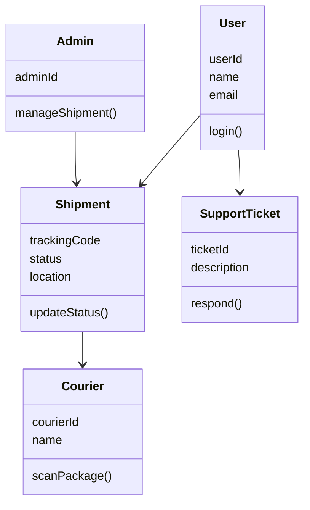

```mermaid
classDiagram
  class User {
    userId
    name
    email
    login()
  }

  class Shipment {
    trackingCode
    status
    location
    updateStatus()
  }

  class Courier {
    courierId
    name
    scanPackage()
  }

  class Admin {
    adminId
    manageShipment()
  }

  class SupportTicket {
    ticketId
    description
    respond()
  }

  User --> Shipment
  Shipment --> Courier
  User --> SupportTicket
  Admin --> Shipment
```
